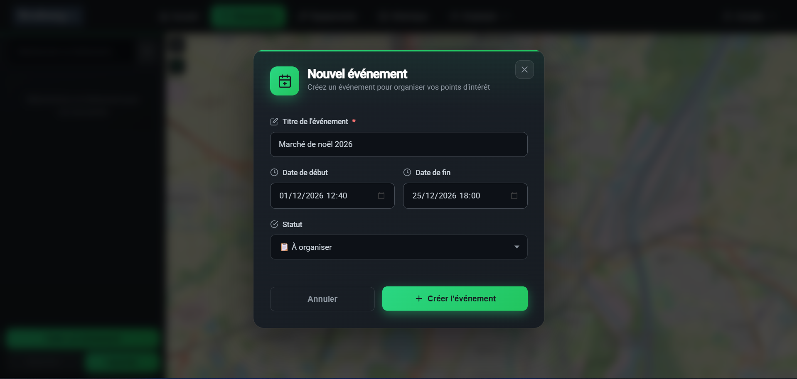
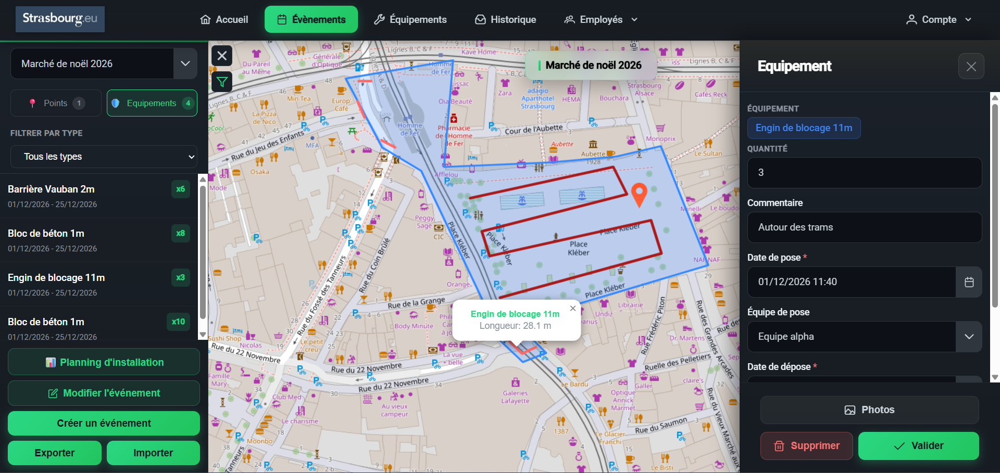
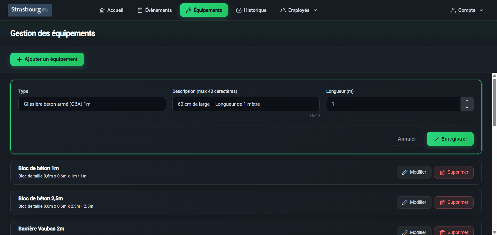
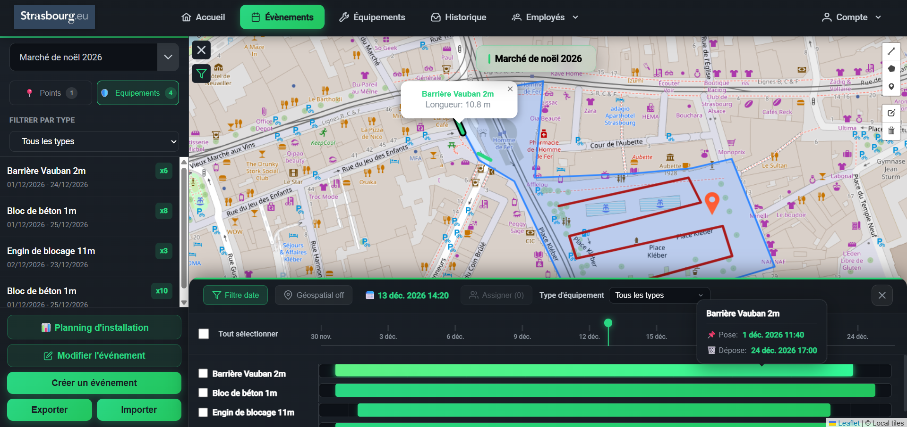
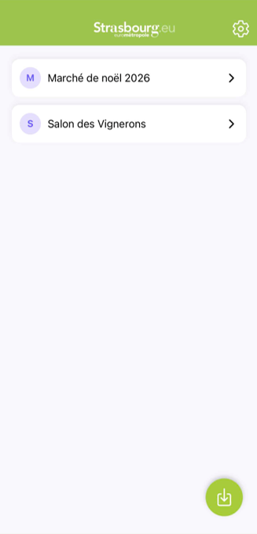
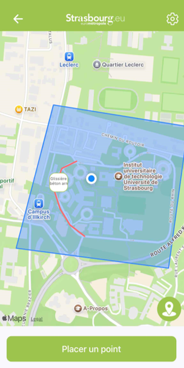
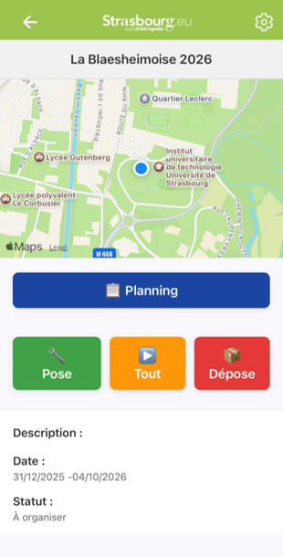

# Ody'stras 🐉
### Projet Níðhöggr - SAÉ 2025-2026

> Application d'aide à l'organisation et la sécurisation de manifestations sportives pour l'Eurométropole de Strasbourg

[](https://dotnet.microsoft.com/)
[](https://angular.dev/)
[](https://reactnative.dev/)
[]()
[](LICENSE)

---

## 📋 Table des matières

- [À propos du projet](#-à-propos-du-projet)
- [Installation et utilisation](#-installation-et-utilisation)
- [Aperçu de l'application](#-aperçu-de-lapplication)
- [Contexte et besoins du client](#-contexte-et-besoins-du-client)
- [Objectifs pédagogiques](#-objectifs-pédagogiques)
- [Ce que fait Ody'stras](#-ce-que-fait-odystras)
- [Fonctionnalités par version](#-fonctionnalités-par-version)
- [Technologies et architecture](#-technologies-et-architecture)
- [Réalisations techniques](#-réalisations-techniques)
- [Qualité et tests](#-qualité-et-tests)
- [Équipe](#-équipe)
- [Calendrier du projet](#-calendrier-du-projet)
- [Documentation complémentaire](#-documentation-complémentaire)

---

## 🎯 À propos du projet

**Ody'stras** est une application complète développée dans le cadre du projet scolaire **Níðhöggr** (SAÉ 2025-2026), en partenariat avec le service des sports de l'Eurométropole de Strasbourg.

### Qu'est-ce que Ody'stras ?

Une solution numérique en **trois composantes** pour gérer la logistique des événements sportifs :

1. **🖥️ Application Desktop (Web)** - Planification et gestion centrale
   - Planification complète des événements sur carte interactive
   - Gestion des équipements, équipes et plannings
   - Export et génération de documents (PDF, Excel, JSON)

2. **📱 Application Mobile** - Saisie sur le terrain
   - Enregistrement de points d'intérêt avec GPS
   - Prise de photos et commentaires
   - Guidage vers les points de sécurisation

3. **⚙️ Backend API** - Serveur central de données
   - Stockage de toutes les informations
   - Authentification sécurisée
   - Synchronisation en temps réel entre appareils

### Périmètre
Manifestations organisées sur les voies publiques de la ville de Strasbourg et de l'Eurométropole.

---

## � Installation et utilisation

### Installation de l'application Desktop (Windows)

**Télécharger l'installateur** :

👉 **[Télécharger OdyStras Installateur (Windows)](https://git.unistra.fr/t5-nidhoggr/t5-electron/-/raw/main/public/OdyStras_installateur.exe?ref_type=heads)**

⚠️ **Important** : Lors du téléchargement et de l'installation, Windows peut afficher un message d'avertissement car l'application n'est pas signée numériquement. Ceci est normal pour un projet éducatif.

**Procédure d'installation** :
1. Téléchargez le fichier `OdyStras_installateur.exe`
2. Si Windows affiche "Windows a protégé votre ordinateur" :
   - Cliquez sur **"Informations complémentaires"**
   - Puis cliquez sur **"Exécuter quand même"**
3. Suivez les instructions de l'installateur
4. Lancez l'application depuis le menu Démarrer ou le raccourci sur le bureau

### Installation de l'application Mobile (Android)

**Scanner le QR Code avec votre téléphone Android** :

<div align="center">


*Scannez ce QR Code pour télécharger l'application mobile Android*

</div>

**Installation** :
- Suivez les instructions pour installer l'APK
- Si demandé, autorisez l'installation depuis des sources inconnues dans les paramètres de votre téléphone

⚠️ **Note** : L'application est actuellement disponible uniquement sur Android

### Connexion entre Desktop et Mobile

⚠️ **Important** : Pour que les applications Desktop et Mobile puissent communiquer, elles doivent être **connectées sur le même réseau WiFi local**.

---

## 📸 Aperçu de l'application

### Application Desktop

#### Création d'événements



*Interface de création d'un nouvel événement avec nom, date et description*

#### Placement de zones de sécurité



*Carte interactive permettant de placer des équipements et définir des zones de sécurité*

#### Gestion des équipements



*Gestion des équipements, avec possibilité d'ajout, de modification et de suppression*

#### Génération de plannings



*Vue du planning des équipes avec timeline et affectation des tâches*

### Application Mobile

#### Liste des événements



*Sélection de l'événement après scan du QR Code*

#### Placement de points d'intérêt



*Saisie sur le terrain avec GPS, photos et commentaires*

#### Planning de l'équipe



*Consultation du planning et guidage vers les zones à sécuriser*

---

##  Contexte et besoins du client

### Problématique

Lors de manifestations dans l'espace public de Strasbourg (courses, concerts, festivals), de nombreuses opérations logistiques sont nécessaires pour assurer le bon déroulement et la sécurité de l'événement :

- 🚧 **Pose de barrières** pour sécuriser ou gérer les flux de spectateurs
- 🧱 **Installation de blocs de béton** pour éviter la pénétration de véhicules
- 🏟️ **Mise en place de tribunes** pour les spectateurs
- 💧 **Installation d'auges** pour la prise d'eau
- ⚡ **Déploiement de prises électriques** temporaires
- 🔒 **Sécurisation de zones sensibles** avec équipements spécialisés

Cette logistique complexe nécessite :
- Une **analyse approfondie en amont** des besoins
- Une **planification intelligente** de la mise en œuvre
- Une **coordination efficace** des équipes sur le terrain
- Un **respect strict des contraintes de sécurité** pour les personnes et les biens

### Solution proposée : Ody'stras

Notre application offre un **outil numérique complet** permettant :
1. **Visualisation cartographique** précise des zones d'intervention (mode hors-ligne)
2. **Placement intelligent** des équipements avec calcul automatique des quantités
3. **Gestion chronologique** des opérations avec timeline interactive
4. **Affectation des équipes** et génération de plannings personnalisés (export PDF)
5. **Saisie terrain mobile** avec géolocalisation et photos
6. **Synchronisation ponctuelle** Desktop ↔ Mobile via WebSocket (export event, import points, export planning)
7. **Export complet des données** (JSON, Excel, PDF)

---

## 🎓 Objectifs pédagogiques

Le projet **Níðhöggr** vise à mettre en œuvre l'ensemble des compétences acquises en formation à travers le développement d'Ody'stras.

### Compétences développées

#### 💻 Développement logiciel
- Architecture applicative multi-plateforme (Desktop + Mobile)
- Développement backend avec API RESTful
- Développement frontend avec Angular
- Développement mobile natif avec React Native
- Gestion de base de données relationnelle (SQLite)
- Manipulation de données géographiques (GeoJSON)

#### 📊 Gestion de projet Agile
- Organisation en sprints (4 sprints de développement)
- Méthodologie Scrum (daily meetings, rétrospectives)
- Gestion du backlog et priorisation des fonctionnalités
- Rôle de chef de projet tournant
- Comptes-rendus réguliers (CRCP)
- Démonstrations client en fin de sprint

#### 🔧 DevOps et qualité
- Pipeline d'intégration continue (CI) avec GitLab
- Déploiement continu (CD) automatisé
- Conteneurisation avec Docker
- Tests unitaires et tests d'intégration
- Analyse de qualité du code
- Conventions de codage et revue de code

#### 🗣️ Communication
- Présentations fonctionnelles client
- Documentation technique complète
- Rédaction de rapports d'analyse
- Travail collaboratif en équipe
- Gestion des retours utilisateurs

---

## 💡 Ce que fait Ody'stras

### 🖥️ Application Desktop - Le centre de contrôle

L'application web est l'outil principal de planification et de gestion des événements. Elle fonctionne **entièrement hors-ligne** (pas besoin d'internet).

#### Gestion des événements
- **Créer des projets d'événements** avec nom, date et description
- **Définir des zones géographiques** (polygones, parcours, zones de sécurité)
- **Marquer les événements favoris** pour un accès rapide
- **Archiver les événements terminés** sans les supprimer

#### Cartographie interactive
- **Navigation fluide** sur une carte de Strasbourg stockée localement
- **Recherche d'adresses** et de lieux spécifiques
- **Placement d'équipements** par simple clic sur la carte
- **Dessin de polylignes** pour les barrières avec calcul automatique du nombre nécessaire
- **Ajout de points d'attention** (zones à surveiller) avec symbole d'alerte
- **Filtrage visuel** par type d'équipement (ne voir que les barrières, blocs béton, etc.)

#### Gestion des équipements
- Large **catalogue d'équipements** (barrières Héras, blocs béton, tribunes, auges, prises électriques, etc.)
- **Association de quantités** à chaque point de pose
- **Calcul automatique** du nombre d'équipements selon la longueur des polylignes
- **Photos et commentaires** pour chaque zone de sécurité

#### Gestion des équipes
- **Création d'employés** (nom, prénom, marquage favori)
- **Formation d'équipes** avec affectation des membres
- **Équipes spécialisées** : équipe d'installation et équipe de démontage distinctes
- **Affectation aux zones** : chaque zone de sécurité peut avoir des équipes dédiées

#### Timeline et chronologie
- **Définition des horaires** de pose et dépose pour chaque équipement
- **Parcours temporisés** avec vitesses min/max configurables
- **Visualisation chronologique** : voir l'évolution de l'installation dans le temps
- **Défilement pas à pas** : avancer ou reculer dans le temps pour voir l'état à un instant T
- **Animation** de la chronologie des installations

#### Génération de plannings
- **Création automatique** de plannings par équipe
- **Export PDF** des plannings pour distribution sur le terrain
- **Vue Gantt** pour visualiser les tâches dans le temps
- **Attribution d'actions** (pose/dépose) à chaque équipe

#### Exports et impressions
- **Export Excel** avec toutes les informations des équipements
- **Export JSON** complet d'un événement (sauvegarde/partage)
- **Import JSON** pour restaurer ou dupliquer des événements
- **Génération PDF** de la carte avec les informations pertinentes
- **Génération de QR Code** pour synchronisation mobile

#### Synchronisation ponctuelle
- **WebSocket pour opérations ciblées** : utilisé uniquement pour des actions spécifiques (export d'événement, import de points, export de planning)
- **Connexion temporaire** : la liaison WebSocket est établie uniquement pendant l'opération puis fermée automatiquement
- **Réouverture à la demande** : scanner à nouveau le QR Code pour réutiliser la synchronisation si nécessaire

---

### 📱 Application Mobile - La saisie terrain

L'application mobile est conçue pour les agents sur le terrain qui doivent enregistrer des informations directement sur site.

#### Affectation à un évènement
- **Scan de QR Code** généré par l'application desktop
- **Récupération automatique** de toutes les informations de l'évènement
- **Visualisation des géométries** (zones, parcours, points existants)

#### Géolocalisation et navigation
- **Position GPS en temps réel** affichée sur la carte
- **Suivi du déplacement** pendant la journée
- **Guidage vers les points** avec calcul d'itinéraire
- **Détection d'arrivée** automatique à un point

#### Saisie de points d'intérêt
- **Enregistrement GPS précis** de la position
- **Prise de photos** multiples (caméra native du téléphone)
- **Ajout de commentaires** textuels pour chaque point
- **Réorganisation** de l'ordre des points par glisser-déposer

#### Planning et guidage
- **Récupération du planning** de l'équipe affectée
- **Liste ordonnée** des zones à sécuriser
- **Guidage zone par zone** : l'app guide vers la prochaine zone
- **Suivi de progression** : validation au fur et à mesure des tâches accomplies
- **Simulation de déplacement** pour tester les parcours

#### Mode hors-ligne
- **Fonctionnement complet sans internet** (données en local)
- **Stockage local** des photos et données
- **Synchronisation différée** : les données sont envoyées au serveur dès la connexion rétablie

#### Transfert de données
- **Envoi vers l'application desktop** de tous les points saisis
- **Synchronisation bidirectionnelle** : front → mobile ET mobile → front
- **Connexion réseau locale requise** : le téléphone et le PC doivent être connectés sur le même réseau (WiFi commun) pour échanger les données
- **Utilisation ponctuelle de WebSocket** : connexion établie uniquement pour l'opération de transfert, puis fermée

---

### ⚙️ Backend API - Le cœur du système

Le serveur backend centralise toutes les données et assure la communication entre les applications.

#### Gestion des données
- **Base de données SQLite locale** : pas besoin de serveur MySQL/PostgreSQL distant
- **Stockage des photos** uploadées depuis le mobile
- **Gestion de fichiers** (exports, imports)

#### Authentification sécurisée
- **Système de login** avec identifiant et mot de passe
- **Mots de passe hashés** avec BCrypt (jamais stockés en clair)
- **Tokens JWT** pour sécuriser les requêtes API
- **Compte administrateur** créé à l'installation

#### API REST complète
- **15+ contrôleurs** couvrant toutes les entités :
  - Events (événements)
  - Equipment (équipements)
  - Points, Areas, Paths (géométries)
  - Employees, Teams (ressources humaines)
  - SecurityZones (zones de sécurité)
  - Actions, Planning (planification)
  - Pictures (photos)
  - Users (utilisateurs)

---

## 🚀 Fonctionnalités par version

Le projet a été développé en **4 versions successives**, chacune ajoutant de nouvelles fonctionnalités.

### 🌟 Version 0 - Hlin (Prototype)

**Objectif** : Validation des choix technologiques (cartographie, export Excel)

#### Application Desktop
- ✅ Affichage et navigation dans une carte de Strasbourg **hors-ligne**
- ✅ Recherche d'adresse ou de lieu (géocodage)
- ✅ Placement d'équipements sur la carte avec quantités
- ✅ Export des informations au format Excel
- ✅ Génération de PDF pour impression de la carte

#### Application Mobile
- ✅ Affichage de la position actuelle (GPS)
- ✅ Enregistrement de points d'intérêt (GPS + commentaire + photos)
- ✅ Liste ordonnée des points d'intérêt
- ✅ Simulation de déplacement entre points
- ✅ Détection automatique d'arrivée et guidage vers le point suivant

---

### 🚀 Version 1 - Frigg (MVP)

**Objectif** : Première version exploitable avec authentification et gestion des projets

#### Nouvelles fonctionnalités Desktop
- ✅ **Authentification sécurisée** (login/mot de passe hashé avec BCrypt)
- ✅ **Gestion des utilisateurs** (compte admin créé à l'installation)
- ✅ **Gestion des personnels**
  - Création/modification/suppression d'employés (nom, prénom)
  - Création/modification/suppression d'équipes avec liste des membres
- ✅ **Gestion des projets d'événements**
  - Création/modification/suppression de projets (nom, date, géométries)
  - Sélection et visualisation de projets existants
  - Ajout de zones géographiques (GeoJSON)
- ✅ **Gestion temporelle des points**
  - Ajout de dates/heures de pose et dépose pour chaque point
  - Affichage chronologique (listes séparées pose/dépose)
  - Tri automatique par date

#### Nouvelles fonctionnalités Mobile
- ✅ **Affectation à un projet** via QR Code scanné sur l'app desktop
- ✅ **Visualisation des géométries** du projet courant
- ✅ **Synchronisation des points** avec l'application desktop

---

### 🔥 Version 2 - Gefjun (Chronologie & Plannings)

**Objectif** : Gestion avancée de la chronologie et des plannings d'équipes

#### Nouvelles fonctionnalités Desktop
- ✅ **Saisie de polylignes** pour barrières et blocs de béton
- ✅ **Calcul automatique** du nombre d'équipements selon la longueur
- ✅ **Gestion chronologique des parcours**
  - Date/heure de début
  - Vitesses minimale et maximale configurables
- ✅ **Timeline interactive**
  - Visualisation chronologique des équipements sur la carte
  - Défilement pas à pas dans le temps
  - Animation de l'évolution des installations
- ✅ **Filtres avancés** par type d'équipement
- ✅ **Points d'attention** (symbole ! avec description, sans notion temporelle)
- ✅ **Affectation équipe-action**
  - Liaison équipements → équipes → actions (pose/dépose)
  - Gestion des zones de sécurité avec équipes dédiées
- ✅ **Génération de plannings** PDF par équipe

#### Nouvelles fonctionnalités Mobile
- ✅ **Récupération du planning** de l'équipe affectée
- ✅ **Guidage point par point** selon le planning
- ✅ **Suivi de progression** dans les tâches

---

### 🏆 Version finale - Gefjun+ (Améliorations)

**Objectif** : Finalisation et perfectionnement du produit

#### Améliorations Desktop
- ✅ **Système de favoris** pour événements et employés
- ✅ **Archivage d'événements** (soft delete)
- ✅ **Gestion des photos** pour zones de sécurité
- ✅ **Descriptions** pour zones et parcours
- ✅ **Recherche avancée** et filtres multiples
- ✅ **Internationalisation** (i18n FR/EN)
- ✅ **Notifications toast** pour feedback utilisateur
- ✅ **Export/Import JSON** complet des événements
- ✅ **Synchronisation WebSocket** en temps réel
- ✅ **Gestion de base de données locale** (SQLite)

#### Améliorations Mobile
- ✅ **Interface utilisateur optimisée**
- ✅ **Mode hors-ligne robuste**
- ✅ **Gestion des photos** avec stockage local
- ✅ **Amélioration de la navigation**

---

## 🛠️ Technologies et architecture

### Stack technique

**Ody'stras** est une application moderne utilisant des technologies de pointe :

#### Frontend Desktop - Angular 20
- **Angular 20.3** : Framework web moderne avec système de signals pour une réactivité optimale
- **TypeScript 5.7** : Typage fort pour un code robuste et maintenable
- **Leaflet.js** : Bibliothèque de cartographie interactive pour l'affichage des cartes
- **MBTiles** : Format de tuiles cartographiques pour le fonctionnement hors-ligne
- **Angular Material & PrimeNG** : Composants UI professionnels et accessibles
- **Better SQLite3** : Base de données locale intégrée à l'application
- **jsPDF** : Génération de documents PDF côté client
- **QRCode.js** : Génération de QR Codes pour synchronisation mobile
- **Gantt Charts** : Visualisation des plannings en diagramme de Gantt

#### Backend API - ASP.NET Core
- **.NET 10.0** : Framework Microsoft dernière génération
- **ASP.NET Core** : Framework API REST haute performance
- **Entity Framework Core** : ORM pour manipuler la base de données
- **SQLite** : Base de données locale (pas besoin de serveur MySQL/PostgreSQL)
- **BCrypt.Net** : Hachage sécurisé des mots de passe
- **JWT (JSON Web Tokens)** : Authentification stateless et sécurisée

#### Mobile - React Native avec Expo
- **React Native 0.81** : Framework cross-platform (iOS + Android en même temps)
- **Expo 53** : Toolchain simplifiant le développement mobile
- **React Navigation** : Navigation native entre écrans
- **React Native Maps** : Affichage de cartes natives
- **Expo Location** : Géolocalisation GPS haute précision
- **Expo Camera** : Accès natif à la caméra
- **Async Storage** : Stockage local persistant pour mode hors-ligne

### Architecture en 3 couches

```
┌──────────────────────────────────────────────────────────┐
│              COUCHE PRÉSENTATION                         │
│                                                          │
│   Application Desktop        Application Mobile         │
│   (Angular Web App)          (React Native)             │
│   - Carte interactive        - GPS & Photos             │
│   - Gestion complète         - Guidage terrain          │
│   - Exports PDF/Excel        - Mode hors-ligne          │
│   - Timeline                 - Scan QR Code             │
└──────────────────────────────────────────────────────────┘
                        ▲
                        │
                        │ HTTP REST API + WebSocket
                        │
                        ▼
┌──────────────────────────────────────────────────────────┐
│              COUCHE MÉTIER (Business Logic)              │
│                                                          │
│   Backend API (ASP.NET Core 10)                          │
│   - 15+ contrôleurs REST                                 │
│   - Services métier                                      │
│   - Authentification JWT                                 │
│   - WebSocket pour temps réel                            │
│   - Upload de fichiers                                   │
└──────────────────────────────────────────────────────────┘
                        ▲
                        │
                        │ Entity Framework Core (ORM)
                        │
                        ▼
┌──────────────────────────────────────────────────────────┐
│              COUCHE DONNÉES                              │
│                                                          │
│   SQLite Database                                        │
│   - Stockage local (pas de serveur distant)              │
│   - 14 tables relationnelles                             │
│   - Stockage de fichiers (photos)                        │
│   - Migrations automatiques                              │
└──────────────────────────────────────────────────────────┘
```

### Fonctionnement hors-ligne

**Contrainte principale du projet** : L'application doit fonctionner **sans accès internet**.

✅ **Notre solution** :
- **Tuiles cartographiques** stockées localement dans l'application (fichiers MBTiles)
- **Base de données SQLite** en local (pas de serveur MySQL distant)
- **Géocodage** : cache local des recherches d'adresses via Nominatim
- **Ressources statiques** : toutes les images, icônes et styles embarqués
- **Mode mobile** : stockage local avec AsyncStorage avant synchronisation

---

## 🔧 Réalisations techniques

### 1. Synchronisation ponctuelle avec WebSocket

#### Qu'est-ce qu'un WebSocket ?

Un **WebSocket** est un protocole de communication bidirectionnelle entre un client (navigateur/app) et un serveur. Contrairement aux requêtes HTTP classiques (client demande → serveur répond), le WebSocket maintient une **connexion temporaire** qui permet :
- Une **communication instantanée** dans les deux sens
- Le **transfert de données en temps réel** pendant l'opération
- Une **notification immédiate** de fin d'opération

#### Notre implémentation

Dans Ody'stras, le WebSocket est utilisé de manière **ponctuelle et non permanente** :

```
┌─────────────┐                    ┌─────────────┐
│  Frontend   │  ←── WebSocket ──→ │   Mobile    │
│  (Angular)  │     (temporaire)   │  (React N.) │
└─────────────┘                    └─────────────┘
       ↑                                  ↑
       │                                  │
       └─── Connexion pour opération ────┘
           (export event, import points,
            export planning)
           Puis fermeture automatique
```

**Cas d'usage** :
1. **Export d'événement vers mobile** : 
   - Mobile scanne QR Code → ouvre WebSocket
   - Backend envoie toutes les données via WebSocket
   - Transfert terminé → fermeture automatique

2. **Import de points depuis mobile** :
   - Mobile envoie les points via WebSocket
   - Frontend reçoit et affiche les nouveaux points
   - Import terminé → fermeture automatique

3. **Export de planning** :
   - Frontend génère et envoie le planning via WebSocket
   - Mobile reçoit le planning
   - Transfert terminé → fermeture automatique

💡 **Important** : Il n'y a qu'une seule application frontend, pas de synchronisation multi-utilisateurs. Le WebSocket sert uniquement aux **échanges ponctuels** entre desktop et mobile.


### 2. Transfert de données Desktop ↔ Mobile

**⚠️ Prérequis important** : Le téléphone et le PC doivent être **connectés sur le même réseau local** (même WiFi) pour pouvoir communiquer.

#### Frontend → Mobile (via QR Code)

**Problème** : Comment transférer un évènement complet vers le mobile sans saisie manuelle ?

**Solution** : QR Code contenant les informations de connexion

```
[Application Desktop]
   │
   ├─ Génère QR Code avec:
   │  • ID de l'événement
   │  • Token d'authentification
   │  • URL du serveur backend
   │
   ▼
[QR Code affiché à l'écran]
   │
   ├─ [Mobile scanne avec caméra]
   │
   ▼
[Application Mobile]
   │
   ├─ Décode le QR Code
   ├─ Se connecte au backend avec le token
   ├─ Télécharge toutes les données de l'événement
   │  • Géométries (zones, parcours)
   │  • Points existants
   │  • Planning de l'équipe
   │
   ▼
[Mobile prêt à travailler hors-ligne]
```

#### Mobile → Frontend (via API + WebSocket)

**Problème** : Comment récupérer les points saisis sur le terrain ?

**Solution** : Upload via API REST + notification WebSocket

```
[Application Mobile]
   │
   ├─ Agent saisit point d'intérêt:
   │  • Coordonnées GPS
   │  • Commentaire
   │  • Photos (base64 ou fichiers)
   │
   ├─ Envoi vers Backend via HTTP POST /api/points
   │  Content-Type: application/json
   │
   ▼
[Backend API]
   │
   ├─ Reçoit les données
   ├─ Sauvegarde en base SQLite
   ├─ Traite les photos uploadées
   │
   ├─ BROADCAST via WebSocket :
   │  "Nouveau point ajouté : { id, lat, lng, ... }"
   │
   ▼
[Tous les Frontends connectés]
   │
   ├─ Reçoivent la notification WebSocket
   ├─ Fetch automatique du nouveau point
   ├─ Mise à jour de la carte en temps réel
   │
   ▼
[Point visible immédiatement sur toutes les cartes]
```

**Format JSON d'échange** :
```json
{
  "id": "uuid-123-456",
  "eventId": "event-789",
  "latitude": 48.5734,
  "longitude": 7.7521,
  "comment": "Barrière endommagée à remplacer",
  "pictures": [
    {
      "filename": "photo1.jpg",
      "data": "base64EncodedImageData..."
    }
  ],
  "createdAt": "2026-01-18T14:30:00Z"
}
```

### 3. Pipeline CI/CD avec GitLab

#### Qu'est-ce que le CI/CD ?

- **CI (Continuous Integration)** : Intégration Continue
  - À chaque commit/push, le code est **automatiquement compilé et testé**
  - Détecte les erreurs **immédiatement** avant qu'elles n'arrivent en production

- **CD (Continuous Deployment)** : Déploiement Continu
  - Le code validé est **automatiquement déployé** sur le serveur
  - Pas besoin de déploiement manuel, tout est automatisé


**Déclenchement automatique** :
- ✅ Push sur `main` → Pipeline complet + déploiement
- ✅ Push sur `develop` → Build + Tests uniquement
- ✅ Merge Request → Build + Tests + Analyse
- ✅ Tag (v1.0.0) → Pipeline + Création de release

**Résultats** :
- ❌ Si un test échoue → Pipeline s'arrête, le code ne peut pas être mergé
- ❌ Si le lint trouve >10 warnings → Pipeline échoue
- ✅ Si tout passe → Déploiement automatique sur le serveur


---

## ✅ Qualité et tests

Nous avons mis en place une **stratégie de test rigoureuse** tout au long du projet pour garantir la qualité et la fiabilité d'Ody'stras.

### 📊 Chiffres clés

| Métrique | Valeur | Cible |
|----------|--------|-------|
| **Couverture de code globale** | **85%** | >80% ✅ |
| **Couverture Frontend** | 87% | >80% ✅ |
| **Couverture Backend** | 83% | >80% ✅ |
| **Couverture Mobile** | 82% | >80% ✅ |
| **Tests unitaires** | 245+ tests | - |
| **Tests d'intégration** | 68 tests | - |
| **Warnings ESLint** | 4 | <10 ✅ |
| **Complexité cyclomatique max** | 12 | <15 ✅ |

### Types de tests réalisés

✅ **Tests unitaires** (Jasmine, xUnit, Jest)
   - Services métier (logique de calcul, gestion d'état)
   - Composants UI (rendering, interactions)
   - Fonctions utilitaires (formatage, validation)

✅ **Tests d'intégration** 
   - Endpoints API REST
   - Flux complets de données
   - Authentification JWT

✅ **Tests fonctionnels**
   - Scénarios utilisateur complets
   - Navigation dans l'application
   - Gestion des erreurs et cas limites

✅ **Tests de non-régression**
   - Validation après chaque sprint
   - Suite de tests automatisée dans le pipeline CI

### Documentation des tests

📄 **Fiches et plans de tests détaillés** :
- **Backend** : [backend/test_plan.md](backend/test_plan.md)
- **Frontend** : [frontend/Nidhoggr_front/test_plan.md](frontend/Nidhoggr_front/test_plan.md)
- **Mobile** : [mobile/nidhoggr/test_plan.md](mobile/nidhoggr/test_plan.md)

Les documents de tests contiennent :
- Scénarios de test précis pour chaque composant
- Résultats attendus vs obtenus
- Analyses critiques et corrections apportées
- Couverture des fonctionnalités (unitaires, intégration, fonctionnels)

### Exécution automatique

Tous les tests sont exécutés **automatiquement** dans le pipeline GitLab CI à chaque push :
- Si un test échoue → le pipeline bloque
- Génération automatique de rapports de couverture
- Notifications d'échec/succès

---

## 👥 Équipe

### Équipe VGD 🔥

Le projet **Níðhöggr** a été réalisé par l'équipe **VGD** composée de:

- 🔸 **Antoine CHAUMET** - Développement Mobile & Tests
- 🔸 **Ziyad BOUQALBA** - Développement Mobile & DevOps (CI/CD)
- 🔸 **Amine BELHAJ** - Développement Fullstack (Backend, Frontend, Architecture BDD) & Tests
- 🔸 **Auguste DELAYE** - Développement Mobile & Gestion de projet & Modélisation BDD
- 🔸 **Luca VALLET** - Développement Fullstack (Backend & Frontend)

### Rôles et responsabilités

- **Chef de projet (tournant)** : Organisation, planification, CRCP
- **Développeurs Backend** : API REST, base de données, services
- **Développeurs Frontend** : Interface web, cartographie, UX
- **Développeurs Mobile** : Application React Native, GPS, caméra
- **Testeurs** : Tests unitaires, plan de test, fiches de tests

### Méthode de travail

- **Méthodologie** : Scrum/Agile
- **Sprints** : 4 sprints de 3-4 semaines
- **Daily meetings** : Synchronisation quotidienne
- **Rétrospectives** : Amélioration continue
- **Code reviews** : Qualité et partage de connaissance


### ⚠️ Important

Conformément aux exigences du projet, **aucune information sensible** (mots de passe, clés API, tokens) n'est présente dans le code source ou le dépôt Git. Toutes les données sensibles sont gérées via :
- Variables d'environnement
- Fichiers de configuration exclus (`.gitignore`)
- ASP.NET User Secrets en développement

---

## 📄 Licence et propriété

Ce projet a été développé dans un cadre **éducatif** pour l'Eurométropole de Strasbourg dans le contexte de la SAÉ Níðhöggr 2025-2026.

© 2025-2026 - Équipe VGD - Tous droits réservés

---

## 🙏 Remerciements

- **Eurométropole de Strasbourg** - Pour la confiance accordée et le sujet passionnant
- **Équipe pédagogique** - Pour l'encadrement, les conseils et les enseignements
- **OpenStreetMap** - Pour les données cartographiques libres
- **Communauté open-source** - Pour tous les outils et bibliothèques utilisés dans ce projet

---

<div align="center">

**Ody'stras** 🐉 - *Sécurisation intelligente des événements sportifs*

*Projet Níðhöggr - SAÉ 2025-2026*

Made with ❤️ by Équipe VGD 🔥

</div>